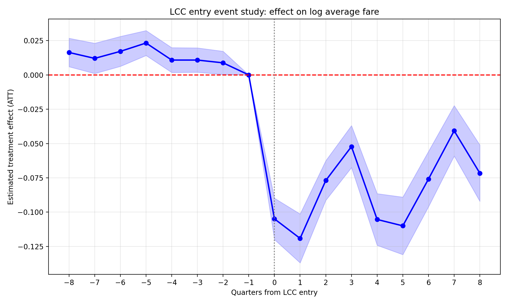
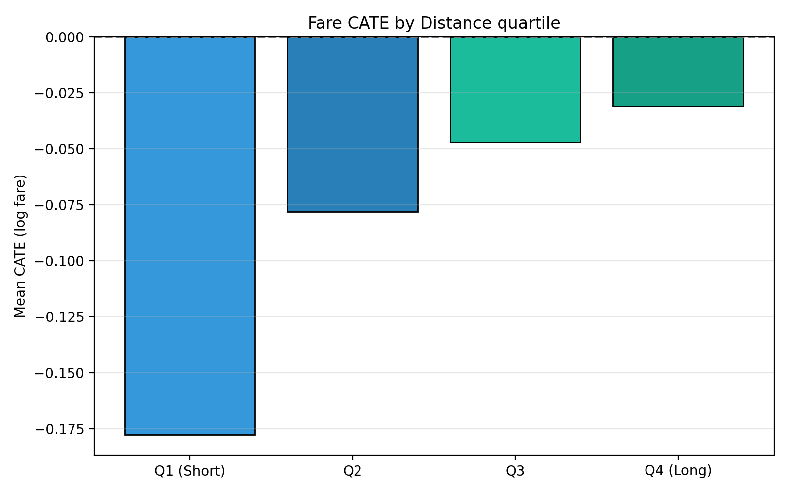

# Heterogeneous Treatment Effects of Low-Cost Carrier Entry in US Airline Markets

> When a low-cost carrier enters a US route, fares fall about 10% on average. That average hides a wide range: roughly 16% on short, concentrated routes and about 3% on long, already-competitive ones.

This project measures the effect of low-cost carrier (LCC) entry on US domestic airfares and, more to the point, shows how that effect changes from route to route. It uses twenty quarters of public ticket and traffic data and a two-stage causal design.

## The question

Carriers like Spirit or Southwest do not enter routes at random. They go after busy, high-fare corridors where they can undercut the incumbent, so a plain comparison of "entered" against "not entered" routes confuses *where* they choose to fly with *what their arrival does to price*. The analysis separates those two things, then answers a sharper question than "does entry cut fares?":

**On which routes does entry cut fares the most, and by how much?**

In practical terms, a short hop such as Chicago to Detroit gets a much larger fare cut when an LCC arrives than a long, coast-to-coast route such as New York to Los Angeles.

## How it works

The data is a panel of 1.3 million route-quarter records built from two Bureau of Transportation Statistics sources covering 2015 to 2019: the DB1B ticket survey (fares) and the T-100 segment file (traffic). A route is "treated" the first quarter any of five carriers arrives where there was none before: Southwest, JetBlue, Spirit, Frontier, Allegiant.

The estimate is built in two stages.

1. **Matched difference-in-differences.** Every entered route is paired with a similar route that never got an LCC, matched on six pre-entry features (fare, traffic, distance, market concentration, number of carriers, and recent fare trend). Tracking fares around entry for the matched pairs gives the average effect, with the selection problem and the bias from staggered entry timing removed.
2. **Causal forest.** A machine-learning estimator (`CausalForestDML`) then estimates a separate effect for *every* route, so the single average can be opened up and explained by route characteristics.

## What it finds

- **Fares drop about 10% in the quarter an LCC arrives** and stay down around 8% for two years. Passengers rise about 34%. The matched routes are nearly identical before entry, and the pre-entry trend runs *against* the effect, so 10% is a cautious estimate rather than an inflated one.
- **Route distance explains most of the variation, about 74%.** Short routes lose roughly 16% of their fare, long routes only about 3%. Low-cost carriers have their biggest cost advantage on short, point-to-point hops.
- **Market concentration matters next**, in a clean order: the most concentrated routes drop about 13%, the least about 4%. The more pricing power the incumbent had, the more room an entrant has to undercut.
- **Busy routes attract LCCs but do not get bigger fare cuts** once distance and concentration are taken into account. Where carriers enter and how much fares fall are driven by different things.
- **The result is stable.** Fake (placebo) entry dates show almost no effect, removing JetBlue barely changes it, and an independent short-against-long split reproduces the distance gap (about 15% against 5%). A best-linear-projection test confirms the route-to-route differences are systematic, not noise (t = 12.3).



*Fares are flat before entry, then drop sharply the quarter a carrier arrives and stay down.*



*The fare cut is largest on the shortest routes (left) and fades to almost nothing on the longest (right).*

## Repository layout

```
src/
  config.py          paths and fixed parameters
  data/
    parse_db1b.py    DB1B ticket zips  -> carrier-quarter table
    parse_t100.py    T-100 traffic zips -> carrier-quarter capacity
    build_panel.py   merge into the market-quarter panel
  matching.py        Stage 1a: propensity score matching
  event_study.py     Stage 1b: event study (fares, passengers)
  causal_forest.py   Stage 2: per-route effects, group summaries, validation
  robustness.py      placebo, JetBlue exclusion, distance subsample
  diagnostics.py     model-fit checks (AUC, within-R2, nuisance fit)
  descriptives.py    descriptive figures
run_pipeline.py      runs every stage in order
outputs/             saved tables and figures (committed)
```

## Reproduce it

**Setup** (Python 3.11):

```
python -m venv .venv
.venv\Scripts\activate        # Windows; on macOS/Linux use source .venv/bin/activate
pip install -r requirements.txt
```

**Get the data.** Both sources are free from BTS and are not stored here. Drop the
zip files into `data/raw/db1b/` and `data/raw/t100/`. The parsers read every `.zip`
in those folders, so the original BTS filenames are fine.

DB1B Market (twenty quarterly files) can be pulled directly:

```
for y in 2015 2016 2017 2018 2019; do for q in 1 2 3 4; do
  curl -o "data/raw/db1b/DB1BMarket_${y}_${q}.zip" \
    "https://transtats.bts.gov/PREZIP/Origin_and_Destination_Survey_DB1BMarket_${y}_${q}.zip"
done; done
```

T-100 Domestic Segment comes from the TranStats site (Aviation, then Air Carrier
Statistics, then T-100 Domestic Segment for U.S. Carriers). Download each year from
2015 to 2019 with the fields `YEAR, MONTH, UNIQUE_CARRIER, ORIGIN, DEST, PASSENGERS,
SEATS, DEPARTURES_PERFORMED, CLASS, ORIGIN_COUNTRY, DEST_COUNTRY`, and save the zips
into `data/raw/t100/`.

**Run:**

```
python run_pipeline.py
```

The stages run in order. The causal forest takes a few minutes and the rest are
quick. Use `python run_pipeline.py --from matching` to resume once the panel is
built, or run a single stage with, for example, `python -m src.matching`. Every
random step uses seed 42, so a clean run reproduces the tables and figures in
`outputs/`.

## License

Released under the MIT License: anyone is free to use, modify, and build on this
work. See [LICENSE](LICENSE).
